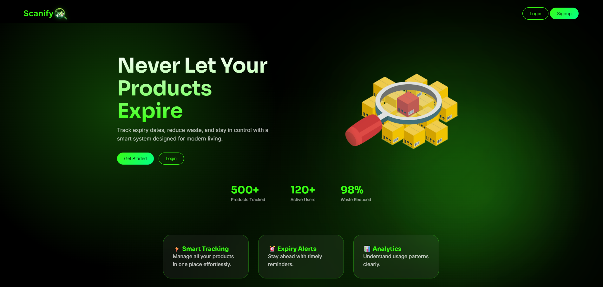
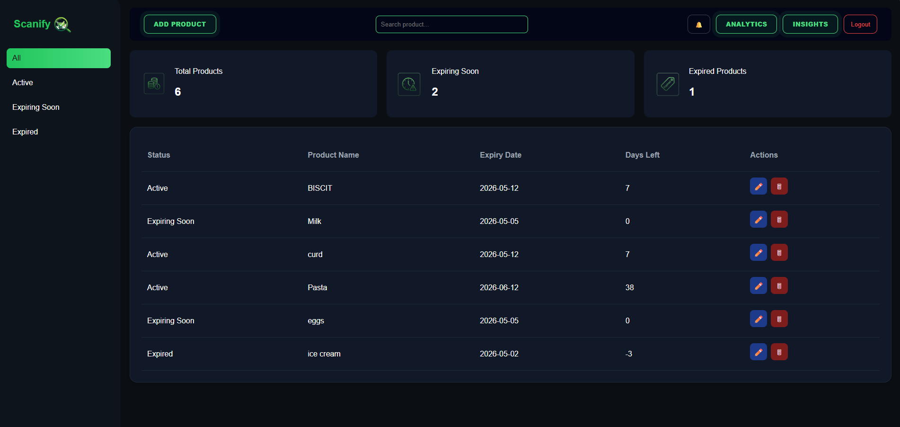
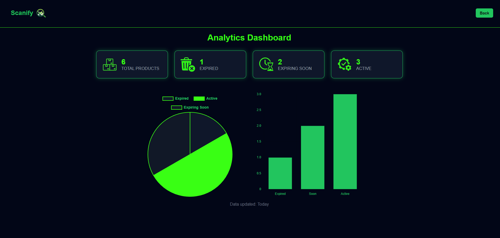
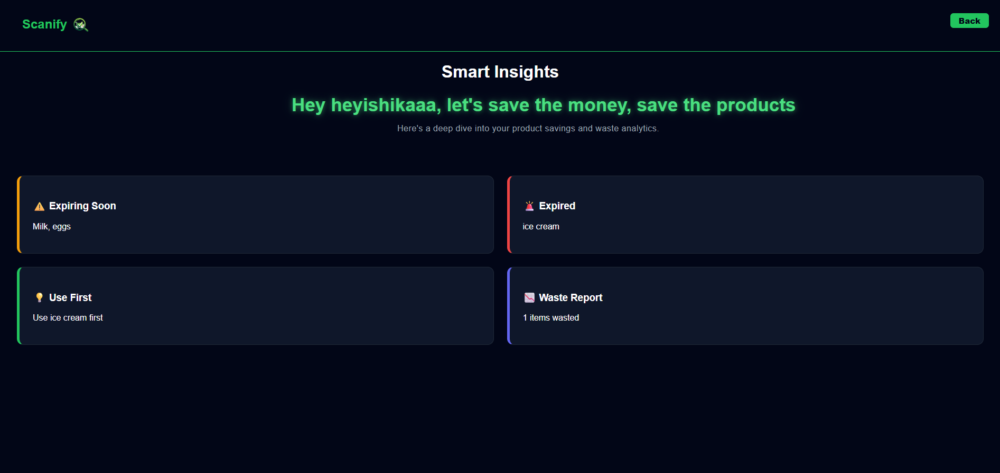
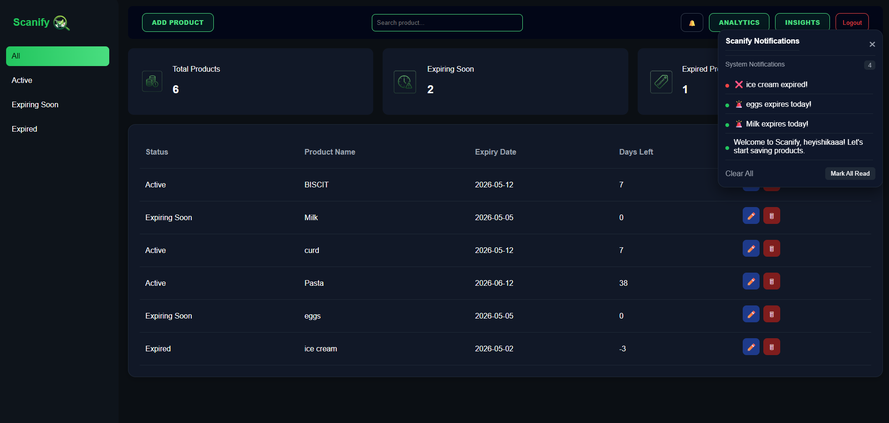

# 🚀 Scanify – Smart Expiry Tracking Web App

Scanify is a smart inventory management web application that helps users track product expiry dates, reduce waste, and stay organized using real-time analytics and notifications.

---

## 📌 Features

### 🏠 Dashboard

* Add, edit, and delete products
* Track expiry dates and days left
* Filter products (Active, Expiring Soon, Expired)
* Search functionality

### 📊 Analytics Page

* View total products, expired, expiring soon, and active items
* Interactive charts (Pie & Bar)
* Visual insights for better decision making

### 🔔 Smart Notifications

* Alerts for:

  * Products expiring tomorrow
  * Products expiring today
  * Expired products
* In-app notification panel with history

### 💡 Insights Page

* Waste reports and product insights
* AI-style suggestions to reduce product wastage

---

## 🛠️ Tech Stack

* HTML5
* CSS3 (Custom Dark UI)
* JavaScript (Vanilla JS)
* LocalStorage (for data persistence)
* Chart.js (for analytics visualization)

---

## 📂 Project Structure

```
Scanify/
│
├── Dashboard/
│   ├── dashboard.html
│   ├── dashboard.css
│   └── dashboard.js
│
├── Analytics/
│   ├── analytics.html
│   ├── analytics.css
│   └── analytics.js
│
├── Insights/
│   ├── insights.html
│   ├── insights.css
│   └── insights.js
│
├── User/
│   ├── login.html
│   └── signup.html
│
├── assets/
│   └── (icons & images)
│
└── README.md
```

---

## ⚙️ How It Works

* User logs in
* Products are stored in **LocalStorage per user**
* Dashboard manages inventory
* Analytics reads the same data and generates insights
* Notifications trigger based on expiry dates

---

## 🚀 Getting Started

1. Clone the repository:

```
git clone https://github.com/your-username/scanify.git
```

2. Open the project folder

3. Run using Live Server (recommended)

---

## 🌐 Deployment

This project can be deployed easily using:

* Netlify
* Vercel

---

## 📸 Screenshots

### HOME


### Dashboard


### Analytics


### Insights


### Notification


---

## 🔮 Future Improvements

* 📱 Responsive design (mobile support)
* ☁️ Backend integration (database instead of LocalStorage)
* 🤖 AI-powered insights and recommendations
* 📊 Advanced analytics (weekly/monthly trends)

---

## 👨‍💻 Author

**Ishika Singh Rajput**

---

